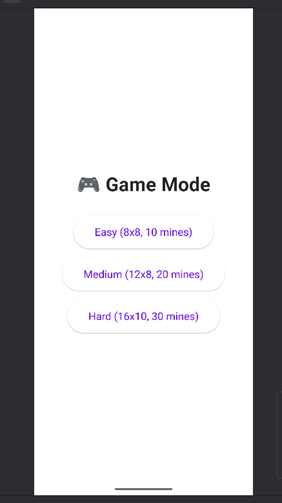
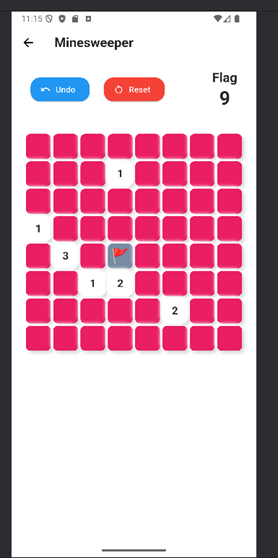

- [Lab: Write your first Flutter app](https://docs.flutter.dev/get-started/codelab)
- [Cookbook: Useful Flutter samples](https://docs.flutter.dev/cookbook)

# 🧨 Minesweeper Flutter App

A simple yet complete implementation of the classic **Minesweeper** game using **Flutter**. The game includes multiple difficulty levels, an intuitive user interface, and features like undo and reset.

---

## 🚀 Features

- ✅ 3 Difficulty levels: Easy, Medium, Hard
- 🎮 Interactive grid-based gameplay
- 🔁 Undo last action (up to 10 steps)
- 🔄 Reset the game anytime
- 🚩 Long-press to place or remove a flag
- 🎉 Win/Lose condition handling with snackbar alerts

---

## 📱 Screenshots

---

## 🧩 Game Rules

- Left click (tap): open a cell.
- Right click (long press): mark/unmark cell with a flag.
- A number in the cell indicates how many mines are adjacent (max 8).
- If a cell with no mines around is opened, adjacent cells will be revealed recursively.
- The game ends when:
    - 💣 A mine is clicked → **Game Over**
    - ✅ All safe cells are revealed → **You Win**

---

## 🧠 Architecture Overview

